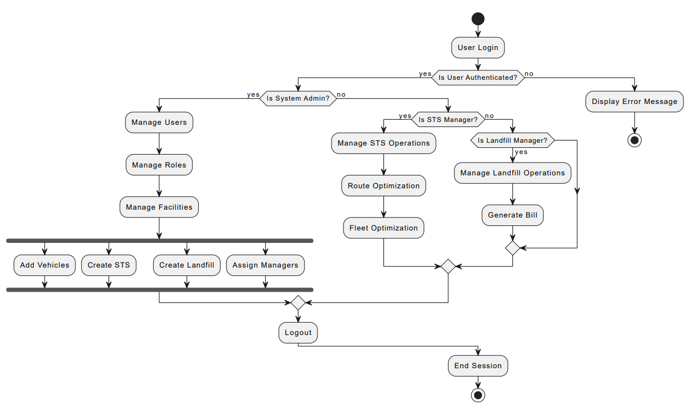

# EasyCity: Waste Management Web Application

EasyCity is a web application designed to streamline and optimize solid waste management processes within the Dhaka North City Corporation (DNCC). It serves as a centralized platform for various stakeholders involved in waste collection, transportation, and processing.

## Key Features

- **User Management**: Role-based access control (RBAC) with user authentication and authorization.
- **Facility Management**: Create and manage Secondary Transfer Stations (STS) and Landfill sites.
- **Vehicle Management**: Add and assign trucks to STS, track waste transportation.
- **Data Entry & Billing**: Record truck entries, generate billing slips based on weight and fuel allocation.
- **Route Optimization**: Select optimized routes for waste transfer to Landfill sites.
- **Fleet Optimization**: Determine the minimum cost and optimal number of trucks for waste transfer.
- **Dashboard Statistics**: Real-time monitoring of waste collection and transportation activities.

## Technologies Used

- Frontend: HTML, CSS, React.js
- Backend: Node.js, Express.js
- Database: MongoDB
- Authentication: JSON Web Tokens (JWT)

## Installation

1. git clone https://github.com/fahadPathan7/CS24-p2-NOWAYHOME.git
2. (create dotenv file inside the root, Frontend and Backend folder.)
3. Go to terminal
4. npm run build
5. npm start

The application will be running on `http://localhost:5173/`.

## Usage

1. Register and log in to access the application.
2. Navigate through different modules based on user roles.
3. Perform necessary operations such as adding vehicles, managing facilities, and generating billing slips. (System Admin role)
4. Utilize route and fleet optimization features for efficient waste transfer. (STS Manager role)
5. Monitor real-time statistics and reports via the dashboard.

## Credentials
- System Admin
    - email: admin@gmail.com
    - pass: 123456
- STS Manager
  - email: sts@gmail.com
  - pass: 123456
- Landfill Manager
  - email: landfill@gmail.com
  - pass: 123456
- Unassigned
  - email: unassigned@gmail.com
  - pass: 123456

## Ports
- Frontend: 5173
- Backend: 3000

## Activity diagram
This section provides a visual representation of the activities within the EasyCity web application. The activity diagram illustrates the sequence of actions and decision points involved in managing waste within the Dhaka North City Corporation (DNCC) jurisdiction.

The diagram depicts the flow of activities from user authentication and role-based access control to various management functionalities such as facility management, vehicle management, data entry and billing, route optimization, fleet optimization, and dashboard statistics monitoring.

## API documentation
Please find our API documentation [here](./extras/API_documentation.xlsx).

## Contributing

Contributions are welcome! Please open an issue or submit a pull request with your suggestions or enhancements.

## License

This project is licensed under the [MIT License](LICENSE).
